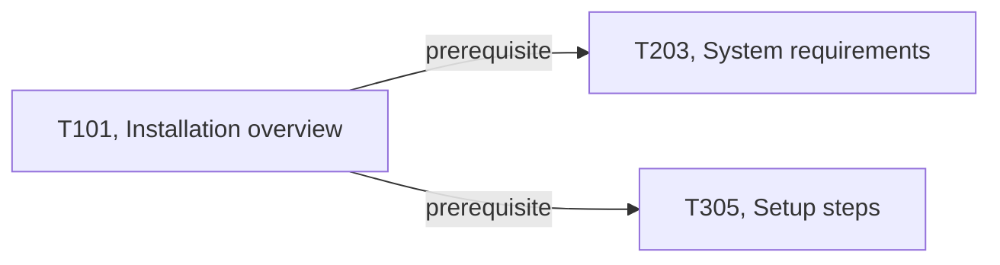

# Mermaid support

Enclose the Mermaid code within three backticks and add the `mermaid` language qualifier, like so:

<codeblock>

```mermaid
flowchart LR
    A["T101, Installation overview"] --> | prerequisite | B["T203, System requirements"]
    A --> | prerequisite | C["T305, Setup steps"]
```
</codeblock>

---

```mermaid
flowchart LR
    A["T101, Installation overview"] --> | prerequisite | B["T203, System requirements"]
    A --> | prerequisite | C["T305, Setup steps"]
```

